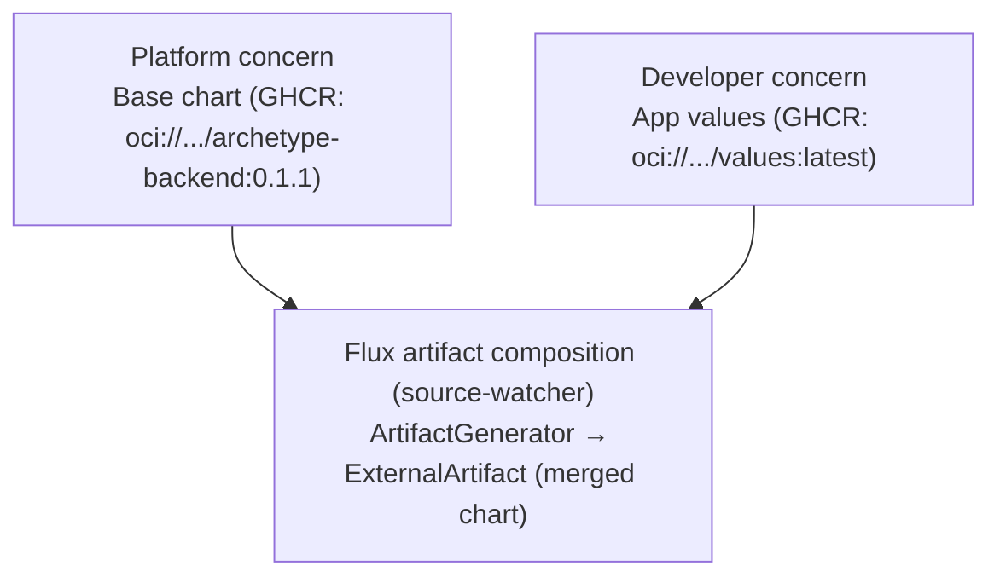

# Declarative Deploys Showcase

A demonstration of decoupled platform engineering and application development workflows using Flux CD,
OCI artifacts, and Kyverno on a local kind cluster — presented as a progression of five isolated tiers,
each adding one capability on top of the last.

New to this repository and doing the actual migration work? Read [`GAMEPLAN.md`](GAMEPLAN.md) first — a
short, non-technical framing of why this progression exists and what each tier buys you.

## Tiers

This repository demonstrates the platform/application split, GitOps delivery, and supply-chain
governance as a progression rather than a single finished state. Each tier is a fully isolated
directory — its own kind cluster, its own OpenTofu stack, its own manifests — that peels back
capability from the final tier (`tier-4`, which is the complete showcase). Read them in order; each
tier's `README.md` ends with a "Progressing to tier-(N+1)" section explaining exactly what changes and
why.

The throughline: Flux and a deployer tool already exist, but with no platform/app split (tier 0) →
separating platform and application ownership (tier 1) → decoupling application deploys from git
commits (tier 2) → authorizing who can deploy (tier 3) → verifying what gets deployed (tier 4).

| Tier | Name | Introduces |
| :--- | :--- | :--- |
| [tier-0](tier-0/README.md) | Flux + deployer tool | Raw manifests, git-committed by a deployer tool, Flux-reconciled — the real-world baseline. |
| [tier-1](tier-1/README.md) | Helm chart split | Platform-owned chart vs. app-owned values; the core platform/app lesson. |
| [tier-2](tier-2/README.md) | OCI-published values | App team deploys by publishing an OCI artifact, no git commit required. |
| [tier-3](tier-3/README.md) | SpiceDB ReBAC | Admission-time authorization: who is allowed to deploy. |
| [tier-4](tier-4/README.md) | Full governance | Opt-in policy scoping, image-revision integrity, base-image attestation, Policy Reporter. |

Start at `tier-0` and work upward, or jump straight to `tier-4` if you want the full, final architecture.
Unfamiliar with a term such as Kyverno, Flux, or SpiceDB? See the [Glossary](#glossary).

## Overview

At its most complete (`tier-4`), this repository demonstrates a separation of concerns between
**platform teams** and **application teams**:

* **Platform engineering**: owns archetype Helm charts (`tier-N/charts/`) and cluster-wide governance
  policies. Charts are packaged and published to GitHub Container Registry (GHCR) with SemVer tags.
* **Application development**: owns application source code and deployment parameters
  (`tier-N/apps-source/values.yaml`). From tier 2 onward, application teams deploy by publishing
  container images and `values.yaml` artifacts to GHCR using a mutable `latest` tag without making git
  commits to the cluster repository.
* **Cluster infrastructure**: each tier provisions its own local kind cluster and bootstraps whatever
  subset of Flux CD / Kyverno that tier needs, using OpenTofu (`tier-N/kind-cluster/`).
* **Reconciliation & composition** (tier 2+): Flux `source-watcher` composes the platform base chart and
  developer values into an `ExternalArtifact`, triggering immediate event-driven upgrades in
  `helm-controller` (`tier-N/clusters/kind/`).



This diagram reflects tier 2 and above — see the [Tiers](#tiers) section above for what's present at
earlier tiers.

---

## Automated change approval

Decoupling deploys from git commits removes a control that is easy to overlook. At tiers 0 and 1 the
application team commits to git, so every change travels through a pull request, and someone other than
the author approves it before it merges. Four-eyes review is the control, and the git history is the
evidence. The delivery mechanism supplies both.

Tier 2 replaces the delivery mechanism, and the control disappears with it. Publishing an OCI artifact is
the deploy, so no pull request exists against the thing that deploys, and no one approves it. Tiers 3 and
4 add authorization, which answers whether the actor was allowed, and build provenance, which answers
where the artifact came from. Neither answers whether anyone examined the change before it shipped.

[`docs/spikes/`](docs/spikes/README.md) holds time-boxed investigation drafts into automated pre-exposure
gates that carry that approval forward without a human. They are framed against ISO/IEC 27001:2022 Annex
A, Clause 8. They describe proposed work rather than implemented capability: no tier enforces a
change-approval gate today.

---

## Directory structure

* [`tier-0/`](tier-0/) through [`tier-4/`](tier-4/): isolated tier directories, each with its own
  `kind-cluster/` (OpenTofu), application/chart/policy manifests, and `README.md` explainer. See
  [Tiers](#tiers) above.
* [`.github/workflows/`](.github/workflows/): GitHub Actions workflows for publishing charts, images,
  and values artifacts with build provenance attestations. Each workflow notes the tier it becomes
  relevant at.
* [`docs/spikes/`](docs/spikes/README.md): drafts of proposed investigations into automated change
  approval for tiers 2 through 4. See [Automated change approval](#automated-change-approval).

---

## Glossary

Technology referenced across the tiers, in the order a reader meets it.

* **[kind](https://kind.sigs.k8s.io/)**: runs a local Kubernetes cluster inside Docker containers. Every
  tier creates its own kind cluster, named `tier-N`.
* **[OpenTofu](https://opentofu.org/)**: an open-source, community-governed fork of Terraform. Each
  tier's `kind-cluster/` provisions the kind cluster and bootstraps Flux, Kyverno, and the other
  cluster-level components through it.
* **[Flux](https://fluxcd.io/)**: the GitOps toolkit that reconciles this repository's manifests, Helm
  releases, and OCI artifacts into each cluster. Introduced at tier 0 through the
  `flux-operator` chart and a `FluxInstance` custom resource, which tells `flux-operator` which
  controllers to run and which git repository to sync.
  * **`source-controller`**: the Flux controller that fetches and verifies `GitRepository` and
    `OCIRepository` sources.
  * **`source-watcher`**: a Flux extension controller that reconciles `ArtifactGenerator` objects,
    composing multiple sources into one `ExternalArtifact`. Introduced at tier 2.
  * **`helm-controller`**: the Flux controller that reconciles `HelmRelease` objects into installed or
    upgraded Helm releases.
  * **`kustomize-controller`**: the Flux controller that applies plain Kubernetes manifests from a
    `Kustomization`, used at tier 0 before any chart exists.
* **`OCIRepository`**: a Flux source type that tracks an OCI (Open Container Initiative) artifact in a
  registry, such as a published Helm chart or a values payload, and re-pulls it on an interval or a
  registry event. Introduced at tier 1.
* **`HelmRelease`**: a Flux resource that installs or upgrades a Helm chart with a given set of values.
  Present from tier 1 onward.
* **`ArtifactGenerator`** / **`ExternalArtifact`**: a `source-watcher` resource pair that composes several
  OCI sources — here, the platform chart and the application's values — into one merged artifact at
  reconcile time, inside the cluster. Introduced at tier 2, and the reason no CI-issued attestation can
  cover the artifact that actually deploys (see [Automated change approval](#automated-change-approval)).
* **Admission controller**: a Kubernetes component that inspects every object the cluster is about to
  create or update, and can allow, block, or modify it before that happens. Tier 3 is the first tier with
  one.
* **[Kyverno](https://kyverno.io/)**: a Kubernetes-native admission controller that validates, mutates, or
  generates resources, using declarative rules rather than a general-purpose policy language. Introduced
  at tier 3.
  * **`ClusterPolicy`**: a Kyverno policy that applies cluster-wide, scoped here by namespace or by a
    namespace label.
  * **`verifyImages`**: a Kyverno rule type that checks an OCI image's signature or attestations before
    admitting a workload that references it.
  * **`PolicyException`**: a Kyverno resource that exempts a matching resource from an otherwise
    applicable policy.
* **[Open Policy Agent](https://www.openpolicyagent.org/) (OPA)** and **`conftest`**: a general-purpose
  policy engine and its command-line wrapper for testing structured configuration against Rego policies.
  Referenced in tier 2 and in [`docs/spikes/`](docs/spikes/README.md) as a candidate for policy-as-code
  checks that run in CI, before publication, rather than at Kubernetes admission like Kyverno.
* **[SpiceDB](https://authzed.com/spicedb)**: an open-source authorization database implementing
  relationship-based access control (ReBAC), queried here from a Kyverno `ClusterPolicy` to decide
  whether an actor may deploy a given workload. Introduced at tier 3.
  * **SpiceDB Operator** / **`SpiceDBCluster`**: the operator and the custom resource it manages that run
    an ephemeral, in-cluster SpiceDB instance for this showcase, applied directly through OpenTofu rather
    than through the git-synced manifests.
  * **`zed`**: the schema language SpiceDB uses to define object types, relations, and permissions.
    `fixtures/spicedb/schema.zed` is this repository's human-readable authorization model.
* **ReBAC (relationship-based access control)**: an authorization model that grants permissions based on
  relationships between subjects and resources (for example, "user X has `deploy` on service Y"), rather
  than on roles or fixed rules.
* **[Policy Reporter](https://kyverno.github.io/policy-reporter/)**: a dashboard and API that aggregates
  Kyverno's `PolicyReport` results into a queryable history. Introduced at tier 4.
* **GHCR (GitHub Container Registry)**: the OCI registry (`ghcr.io`) this repository publishes every
  container image, Helm chart, and values artifact to.
* **SemVer (semantic versioning)**: the `MAJOR.MINOR.PATCH` tagging scheme this repository's platform
  chart uses on GHCR, bumped through `publish-chart.yaml`.
* **Attestation**: a signed, tamper-evident statement about an artifact, such as who built it, from what,
  or whether a check passed. Distinct from a plain signature, which proves who signed an artifact but
  carries no statement about it.
* **Provenance**: an attestation's specific claim about where an artifact came from and how it was built.
  Answers where an artifact came from, not whether anyone examined the change it carries — see
  [Automated change approval](#automated-change-approval).
* **[Sigstore](https://www.sigstore.dev/)**, **cosign**, and **Fulcio**: a keyless code-signing system.
  Cosign signs and verifies artifacts using a short-lived certificate that Fulcio issues from an OIDC
  identity, instead of a long-lived private key. Referenced in `docs/spikes/` as the mechanism behind
  attestation verification; not yet wired into any tier's `OCIRepository` or Kyverno policy.
* **SLSA (Supply-chain Levels for Software Artifacts)**: a framework and predicate format for build
  provenance attestations. This repository's CI workflows already produce SLSA provenance through
  `actions/attest-build-provenance`.
* **OIDC (OpenID Connect)**: an identity layer that lets a workflow prove its identity to a third party,
  such as GHCR or Fulcio, without a stored secret. GitHub Actions issues an OIDC token per workflow run,
  which both the attestation and the registry login steps rely on.

---

## Prerequisites

Each tier's tooling is version-pinned via `mise` (see that tier's `mise.toml` and
`kind-cluster/mise.toml`):

```sh
cd tier-N
mise install
```

## Cluster lifecycle

Every tier's cluster lifecycle is managed by its own `tier-N/kind-cluster/cluster.sh`:

```sh
cd tier-N/kind-cluster

./cluster.sh up      # Create the tier's kind cluster and bring up whatever that tier needs
./cluster.sh check   # Check readiness and print component status
./cluster.sh down    # Tear the tier's cluster down
```

> **Note**: `up` and `check` automatically configure `KUBECONFIG` from that tier's OpenTofu state. You
> do not need to export `KUBECONFIG` manually. Tiers use distinct kind cluster names (`tier-0` …
> `tier-4`), so multiple tiers could in principle run side by side.

For the deep-dive on any specific tier's application delivery workflow, governance policies,
attestation verification, or SpiceDB ReBAC setup, see that tier's own `README.md` — most of that detail
now lives in [`tier-4/README.md`](tier-4/README.md), since it's the tier where all of it is present.

CI workflows in [`.github/workflows/`](.github/workflows/) live at the repository root (a GitHub Actions
requirement) but are only meaningful once you've reached the tier that introduces them — each workflow
file notes the tier it becomes relevant at.
