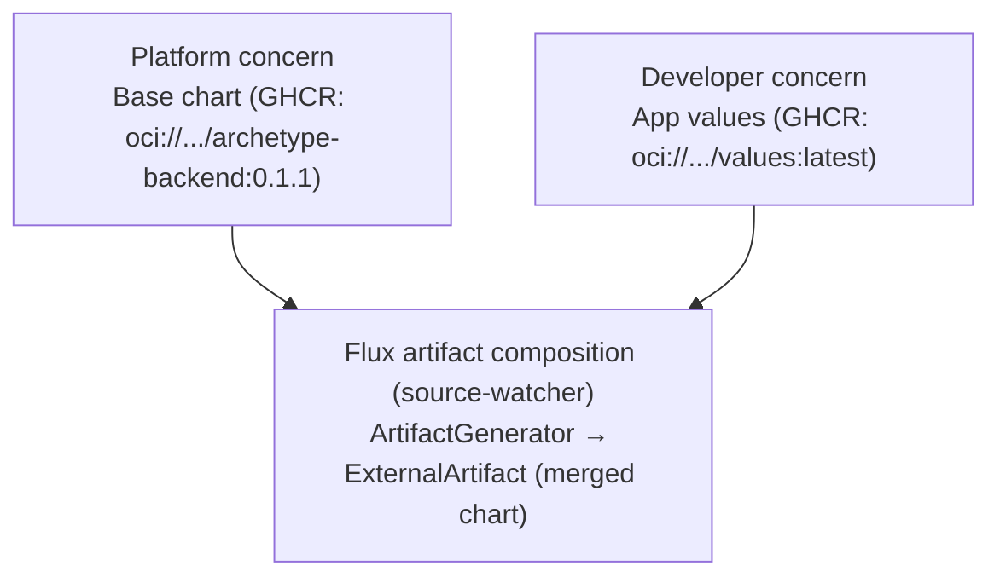

# Declarative Deploys Showcase

A demonstration of decoupled platform engineering and application development workflows using Flux CD,
OCI artifacts, and Kyverno on a local kind cluster — presented as a progression of six isolated tiers,
each adding one capability on top of the last.

## Start here

**[TIERS.md](TIERS.md)** is the landing page for the actual progression: what each tier introduces, in
what order, and why. Start at `tier-0` and work upward, or jump straight to `tier-5` if you want the
full, final architecture.

## Overview

At its most complete (`tier-5`), this repository demonstrates a separation of concerns between
**platform teams** and **application teams**:

* **Platform engineering**: owns archetype Helm charts (`tier-N/charts/`) and cluster-wide governance
  policies. Charts are packaged and published to GitHub Container Registry (GHCR) with SemVer tags.
* **Application development**: owns application source code and deployment parameters
  (`tier-N/apps-source/values.yaml`). From tier 3 onward, application teams deploy by publishing
  container images and `values.yaml` artifacts to GHCR using a mutable `latest` tag without making git
  commits to the cluster repository.
* **Cluster infrastructure**: each tier provisions its own local kind cluster and bootstraps whatever
  subset of Flux CD / Kyverno that tier needs, using OpenTofu (`tier-N/kind-cluster/`).
* **Reconciliation & composition** (tier 3+): Flux `source-watcher` composes the platform base chart and
  developer values into an `ExternalArtifact`, triggering immediate event-driven upgrades in
  `helm-controller` (`tier-N/clusters/kind/`).



This diagram reflects tier 3 and above — see [TIERS.md](TIERS.md) for what's present at earlier tiers.

---

## Directory structure

* [`tier-0/`](tier-0/) through [`tier-5/`](tier-5/): isolated tier directories, each with its own
  `kind-cluster/` (OpenTofu), application/chart/policy manifests, and `README.md` explainer. See
  [`TIERS.md`](TIERS.md).
* [`.github/workflows/`](.github/workflows/): GitHub Actions workflows for publishing charts, images,
  and values artifacts with build provenance attestations. Each workflow notes the tier it becomes
  relevant at.

---

## Prerequisites

Each tier's tooling is version-pinned via `mise` (see that tier's `mise.toml` and
`kind-cluster/mise.toml`):

```sh
cd tier-N
mise install
```

## Cluster lifecycle

Every tier's cluster lifecycle is managed by its own `tier-N/kind-cluster/cluster.sh`:

```sh
cd tier-N/kind-cluster

./cluster.sh up      # Create the tier's kind cluster and bring up whatever that tier needs
./cluster.sh check   # Check readiness and print component status
./cluster.sh down    # Tear the tier's cluster down
```

> **Note**: `up` and `check` automatically configure `KUBECONFIG` from that tier's OpenTofu state. You
> do not need to export `KUBECONFIG` manually. Tiers use distinct kind cluster names (`tier-0` …
> `tier-5`), so multiple tiers could in principle run side by side.

For the deep-dive on any specific tier's application delivery workflow, governance policies,
attestation verification, or SpiceDB ReBAC setup, see that tier's own `README.md` — most of that detail
now lives in [`tier-5/README.md`](tier-5/README.md), since it's the tier where all of it is present.
